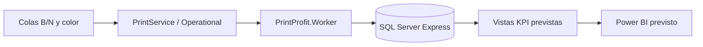

# PrintProfit — Documentación del proyecto y versión 1

Fecha de actualización: 2 de octubre de 2026 (America/La_Paz).

Repositorio: [fabriyvera/PrintProfit.Worker](https://github.com/fabriyvera/PrintProfit.Worker). Rama de desarrollo: `version-1`.

**Estado:** prototipo en desarrollo. Esta documentación registra la reorganización realizada y define el trabajo pendiente para alcanzar la versión 1. No certifica funcionamiento en producción.

## 1. Objetivo del negocio

Registrar trabajos de impresión de la tienda, distinguir blanco y negro (B/N) de color por la cola lógica seleccionada, guardar cargos históricos y consultar indicadores semanales, mensuales y anuales en Power BI.

El diseño contempla un equipo Windows en la tienda con las colas de impresión, SQL Server Express y el servicio PrintProfit. El servicio debe funcionar sin depender de una sesión de usuario.

### Tarifas previstas para el MVP

| Modo | Precio por página |
|---|---:|
| BN | Bs. 0,50 |
| COLOR | Bs. 1,50 |

Estas tarifas provienen del diseño del proyecto. No se ha verificado su carga en una base de datos; no hay un script de seed versionado.

### Impresoras previstas

| Dispositivo | Colas lógicas propuestas |
|---|---|
| Epson L14150 | Epson_L14150_BN, Epson_L14150_COLOR |
| Epson L565 | Epson_L565_BN, Epson_L565_COLOR |
| Epson L5590 | Epson_L5590_BN, Epson_L5590_COLOR |
| KONICA Bizhub 364 | KONICA_Bizhub364_BN |

Los nombres son ejemplos. Los nombres definitivos de Windows deben coincidir con el catálogo SQL. Cada cola debe tener configurado y probado su perfil B/N o color; el nombre por sí solo no cambia la impresión.

## 2. Cambios realizados y alcance de esta actualización

La reorganización quedó registrada en el commit [78b308e](https://github.com/fabriyvera/PrintProfit.Worker/commit/78b308ed369a0f403af311e1170bfac24f77191e):

- Los archivos del Worker pasaron a PrintProfit.Worker/.
- PrintProfit.Domain se incorporó al mismo repositorio.
- La solución PrintProfit.Worker.sln quedó en la raíz.
- Se actualizaron las rutas de ambos proyectos en la solución.
- Se conservó la referencia relativa del Worker a ../PrintProfit.Domain/PrintProfit.Domain.csproj.
- Se ampliaron las exclusiones de archivos generados y configuración local en .gitignore.
- Se conservó el historial Git y el remoto original.

Esta actualización crea la rama version-1 y añade README.md, docs/PROYECTO.md y CHANGELOG.md. No cambia la lógica de impresión ni implementa los pendientes descritos más adelante.

La existencia del proyecto Domain resuelve la ausencia de archivos detectada en la revisión inicial. Su contenido actual es la clase vacía Class1; el DTO todavía pertenece al Worker.

## 3. Estructura actual

```text
PrintProfit/
├── .gitignore
├── README.md
├── CHANGELOG.md
├── PrintProfit.Worker.sln
├── PrintProfit.Domain/
│   ├── Class1.cs
│   └── PrintProfit.Domain.csproj
├── PrintProfit.Worker/
│   ├── Program.cs
│   ├── PrintIngestionService.cs
│   ├── PrintOperationalLogReader.cs
│   ├── SqlPrintRepository.cs
│   ├── PrintJobInsertDto.cs
│   ├── PrintServiceOptions.cs
│   ├── Worker.cs
│   ├── appsettings.json
│   ├── PrintProfit.Worker.csproj
│   └── Properties/launchSettings.json
└── docs/
    └── PROYECTO.md
```

database/, installer/ y un reporte Power BI no están incluidos actualmente. appsettings.Development.json puede existir localmente, pero está excluido de Git.

### Responsabilidades

| Componente | Responsabilidad actual |
|---|---|
| Program.cs | Crea el host, configura el servicio Windows, registra opciones, repositorio y servicio de ingesta antes de Build(). |
| PrintIngestionService | Inicia el lector y mantiene el proceso activo hasta la cancelación. |
| PrintOperationalLogReader | Escucha eventos 307, construye un DTO y lanza la persistencia asíncrona. |
| SqlPrintRepository | Abre una conexión SQL y llama a dbo.usp_InsertPrintJobWithCharge con parámetros. |
| PrintJobInsertDto | Transporta identificadores, cola, documento, usuario, páginas, bytes, estado y fechas. |
| PrintServiceOptions | Configura el nombre del canal de eventos. |
| PrintProfit.Domain | Biblioteca referenciada, todavía sin modelos de negocio implementados. |
| Worker.cs | Clase de la plantilla; Program.cs no la registra como servicio alojado. |

## 4. Arquitectura y flujo



El flujo actual en C# es:

1. Program.cs registra PrintIngestionService.
2. El servicio crea un EventLogWatcher filtrado por Event ID 307.
3. El lector transforma propiedades del evento en PrintJobInsertDto.
4. Una tarea independiente ejecuta SqlPrintRepository.InsertPrintJobAsync.
5. El repositorio llama a dbo.usp_InsertPrintJobWithCharge.
6. El lector registra éxito o error mediante ILogger.

El cobro, la idempotencia y las vistas están previstos en SQL. Su comportamiento no puede verificarse con los archivos actuales del repositorio.

## 5. Tecnologías y dependencias actuales

Ambos proyectos apuntan a net9.0, con nullable e implicit usings habilitados. El Worker utiliza Microsoft.NET.Sdk.Worker.

| Paquete del Worker | Versión declarada | Uso |
|---|---|---|
| Microsoft.Data.SqlClient | 7.0.1 | Acceso a SQL Server. |
| Microsoft.Extensions.Hosting | 9.0.15 | Host, configuración y servicios alojados. |
| Microsoft.Extensions.Hosting.WindowsServices | 9.0.15 | Integración con servicio Windows. |
| Serilog.Extensions.Hosting | 10.0.0 | Integración de Serilog, pendiente de configurar. |
| Serilog.Sinks.File | 7.0.0 | Logs en archivos, pendiente de configurar. |

El lector usa System.Diagnostics.Eventing.Reader. La ejecución requiere Windows; WSL se usa para Git, no para escuchar el canal de eventos de Windows.

Los paquetes Serilog declarados no garantizan por sí solos logs en archivo: Program.cs aún no registra esa integración. La compilación y compatibilidad del conjunto de paquetes deben comprobarse con el SDK instalado; no se ejecutaron como parte de esta actualización documental.

## 6. Configuración

La configuración del Worker utiliza:

```json
{
  "ConnectionStrings": {
    "PrintProfit": "Server=.\\SQLEXPRESS;Database=PrintProfitDB;Integrated Security=True;Encrypt=True;TrustServerCertificate=True;"
  },
  "PrintService": {
    "LogName": "Microsoft-Windows-PrintService/Operational"
  }
}
```

Este ejemplo usa la instancia local. El archivo actual del repositorio apunta a LAPTOP-DV25BA42\\SQLEXPRESS; debe ajustarse a la instalación de la tienda.

Con autenticación integrada, SQL identifica la cuenta que ejecuta el proceso. Los permisos usados al ejecutar desde Visual Studio pueden diferir de los permisos de la cuenta del servicio Windows. Esa cuenta necesita acceso al canal de impresión y al procedimiento SQL.

Las credenciales locales deben guardarse fuera de los archivos versionados, por ejemplo mediante configuración local o variables de entorno compatibles con el host. Las rutas de datos de recuperación y de logs deben tener permisos de escritura para la cuenta del servicio cuando se implementen.

## 7. Hallazgos pendientes de la revisión

### 7.1 Mapeo del evento 307

El código actual toma índices incorrectos de EventRecord.Properties. Debe validarse el XML de un evento real del equipo de la tienda antes de cerrar la corrección.

La estructura habitual que debe contrastarse es:

| Campo | Parámetro del evento | Índice esperado |
|---|---|---:|
| SourceJobId | Param1 | 0 |
| DocumentName | Param2 | 1 |
| SubmittedBy | Param3 | 2 |
| Equipo de origen | Param4 | 3 |
| QueueName | Param5 | 4 |
| Puerto | Param6 | 5 |
| TotalBytes | Param7 | 6 |
| Páginas reportadas | Param8 | 7 |

El lector actual usa [0] como documento, [1] como usuario, [2] como cola, [3] como bytes y [4] como páginas; además, solo exige cinco propiedades. El resultado puede enviar el usuario como cola y páginas nulas.

Como referencias para contrastar el formato: [escenario del repositorio de Microsoft EventLogExpert](https://github.com/microsoft/EventLogExpert/blob/main/src/EventLogExpert.Scenarios/Scenarios/built-in/file-print-and-storage.json) y [ejemplo de XML de un evento publicado en Microsoft Learn Q&A](https://learn.microsoft.com/ru-ru/answers/questions/3817259/windows-10). El ejemplo de Q&A no sustituye la validación del evento local.

Debe rechazarse o auditarse un evento sin datos esenciales, sin inventar páginas. El número reportado debe comprobarse con copias, doble cara y drivers de cada impresora para definir las páginas cobrables.

### 7.2 Recuperación y fallos

Actualmente:

- Se escuchan eventos nuevos, sin bookmark ni recuperación histórica.
- Un fallo de SQL solo se registra en logs; no hay reintento durable.
- Las inserciones usan Task.Run sin límite explícito de concurrencia.
- El servicio no espera esas tareas al cerrarse y pasa un token que se cancela al detenerse.
- EventRecordWritten retorna si no hay EventRecord, sin revisar EventException.
- SubmittedAt y CompletedAt reciben la misma hora del evento de finalización.

La versión 1 debe persistir una posición de lectura solo después de confirmar el procesamiento, recuperar eventos disponibles tras un reinicio y evitar pérdida silenciosa durante fallos temporales. Debe definir qué ocurre al limpiar o reemplazar el log y cómo auditar eventos no recuperables por la retención.

La hora del evento 307 debe describirse como la fecha del evento de finalización. No permite deducir por sí sola la hora original de envío del trabajo.

### 7.3 Persistencia SQL

El repositorio usa parámetros y un procedimiento almacenado, pero el procedimiento no está versionado. Se necesitan tipos y tamaños de parámetros alineados con el contrato SQL, una política de reintentos y pruebas de duplicados.

No se ha verificado la existencia ni el contenido de la base instalada en el equipo del usuario.

## 8. Modelo SQL previsto para la versión 1

Los siguientes elementos son diseño pendiente, no objetos SQL comprobados:

| Objeto | Propósito |
|---|---|
| Printers | Catálogo de colas lógicas y equipo físico. |
| PriceRules | Precio por modo y periodo de vigencia. |
| PrintJobs | Datos y procedencia del trabajo. |
| JobCharges | Cargo y precio congelado por trabajo cobrable. |
| IngestionLog | Auditoría de descartes y errores. |
| Estado de ingesta | Posición o bookmark durable y contexto del origen. |

Scripts previstos:

```text
database/
├── schema.sql
├── seed.sql
├── usp_InsertPrintJobWithCharge.sql
└── views_kpi.sql
```

### Contrato del procedimiento

El Worker envía actualmente:

```text
@SourceEventRecordId, @SourceJobId, @QueueName,
@DocumentName, @SubmittedBy, @TotalPages, @TotalBytes,
@JobStatus, @SubmittedAt, @CompletedAt
```

El procedimiento deberá:

1. Validar el trabajo y resolver la cola registrada.
2. Derivar BN o COLOR de una regla explícita del catálogo/cola.
3. Insertar trabajo y cargo en una transacción.
4. Evitar cargos duplicados incluso ante reintentos concurrentes.
5. Cobrar solo trabajos COMPLETED con páginas cobrables mayores que cero.
6. Resolver la tarifa vigente para la fecha del trabajo, de modo que una recuperación atrasada no tome automáticamente la tarifa del día de ingesta.
7. Congelar precio, páginas cobradas e importe para mantener el histórico.
8. Tratar una cola desconocida o una tarifa ausente como un resultado auditable.

La clave de idempotencia debe contemplar equipo/canal y la generación del log o un mecanismo equivalente. SourceEventRecordId solo no debe asumirse suficiente al limpiar el canal o cambiar el origen. Si se amplía el contrato, DTO, lector y procedimiento deben cambiar juntos.

La zona horaria y los intervalos de vigencia deben acordarse antes de crear los scripts. Para reportes del negocio se propone America/La_Paz, conservando fechas de origen de manera consistente. Las tarifas no deben tener periodos superpuestos para el mismo modo.

## 9. Reportes Power BI previstos

| Vista propuesta | Contenido |
|---|---|
| vw_PrintFact | Fecha, impresora, modo, páginas cobradas e importe por trabajo. |
| vw_KpiWeekly | Ingresos, páginas y mix por semana ISO. |
| vw_KpiMonthly | Los mismos indicadores por mes. |
| vw_KpiYearly | Los mismos indicadores por año. |
| vw_KpiRevenueByPrinter | Ingresos y páginas por impresora y mes. |

Para semana ISO se necesita el año ISO y la semana, o una fecha de inicio de semana inequívoca; agrupar únicamente por año calendario y número ISO falla en los límites de año.

Los importes son cargos calculados por impresión. No equivalen a pagos cobrados, ingresos contables conciliados ni utilidad neta. El MVP no contiene costos, pagos, devoluciones o ventas ajenas a las impresiones.

Power BI deberá conectarse a SQL Server y validar el calendario, las relaciones, los filtros y la actualización de datos. No hay archivo de reporte ni conexión verificada en el repositorio.

## 10. Desarrollo y sincronización

Ruta local del usuario en Windows: E:\Projects\PrintProfit. En WSL: /mnt/e/Projects/PrintProfit.

La rama remota version-1 se creó desde el commit de reorganización 78b308e. Es una rama de trabajo, no una etiqueta de lanzamiento v1.0.0.

Si todavía no existe la rama local:

```bash
cd /mnt/e/Projects/PrintProfit
git fetch origin
git switch --track origin/version-1
```

Si ya existe:

```bash
git switch version-1
git pull --ff-only
```

Comprobar el estado antes de cambiar de rama. Si hay cambios propios pendientes, conservarlos mediante un commit o stash; no usar reset --hard para sincronizar.

En Windows, con el SDK instalado, desde la raíz:

```powershell
dotnet restore PrintProfit.Worker.sln
dotnet build PrintProfit.Worker.sln -c Release
```

Después de corregir la ingesta y disponer de SQL compatible, la prueba en consola será:

```powershell
dotnet run --project PrintProfit.Worker/PrintProfit.Worker.csproj
```

El modo de consola permite validar el flujo antes de instalar el servicio. Esta documentación no reporta una compilación, una impresión de prueba ni una inserción SQL exitosa.

## 11. Plan para completar la versión 1

| Orden | Entrega | Criterio de validación |
|---:|---|---|
| 1 | Compilación y mapeo 307 | Ambos proyectos compilan en Windows; XML reales producen cola, usuario, páginas e ID correctos. |
| 2 | Scripts y contrato SQL | Base desplegable desde scripts; tarifas y cargos coherentes; duplicados no generan cobros adicionales. |
| 3 | Ingesta recuperable | Reinicio y caída temporal de SQL no pierden eventos disponibles; posición durable y concurrencia controlada. |
| 4 | Logs y configuración | Logs persistentes, errores del watcher visibles y opciones inválidas detectadas al inicio. |
| 5 | Operación en la tienda | Colas probadas, cuenta del servicio con permisos, recuperación del servicio y backup/restauración verificados. |
| 6 | KPI y Power BI | Totales conciliados con trabajos conocidos y periodos semanales/mensuales/anuales correctos. |

Domain puede alojar modelos compartidos si son necesarios; mover clases allí no reemplaza las correcciones del flujo.

### Pruebas necesarias antes de lanzar

- Un trabajo BN y uno COLOR de cada impresora aplicable.
- Varias copias y doble cara con conteos esperados.
- Evento repetido, incluyendo reintentos concurrentes.
- Cambio de tarifa y recuperación de un trabajo anterior al cambio.
- Cola desconocida, páginas ausentes o cero y evento mal formado.
- SQL temporalmente inaccesible y posterior recuperación.
- Reinicio del Worker durante una inserción.
- Log deshabilitado, permisos insuficientes y limpieza del log.
- Cruce de año en KPIs semanales ISO.
- Ejecución con la cuenta real del servicio Windows.

## 12. Despliegue previsto

El servicio debe ejecutarse en el equipo que registra los eventos relevantes de las impresoras.

Antes de instalarlo:

1. Instalar SQL Server Express y desplegar los scripts versionados cuando estén disponibles.
2. Crear y probar las colas lógicas; alinear el catálogo SQL.
3. Habilitar el canal Operational y comprobar sus permisos y retención.
4. Configurar conexión, logs y recuperación.
5. Validar una impresión en consola y comprobar trabajo/cargo en SQL.
6. Publicar el Worker e instalarlo como servicio con una cuenta definida.
7. Probar reinicio, recuperación y backup.
8. Conectar y conciliar Power BI.

Se prevén docs/deployment-windows11.md y docs/operacion-colas.md para instrucciones de instalación y operación verificadas. No se han creado en esta actualización. Un MSI puede evaluarse después de validar el flujo básico.

## 13. Checklist del estado actual

- [x] Worker y Domain incluidos en el repositorio.
- [x] Solución en la raíz y rutas reorganizadas.
- [x] Host y registro de dependencias antes de Build().
- [x] Lector 307 y llamada SQL implementados como prototipo.
- [x] Rama version-1 y documentación inicial de cambios.
- [ ] Compilación Release verificada.
- [ ] Mapeo 307 corregido y probado con XML reales.
- [ ] Scripts SQL y reglas de cobro versionados.
- [ ] Idempotencia y tarifas verificadas.
- [ ] Recuperación durable y cierre controlado.
- [ ] Logs en archivo configurados.
- [ ] Colas y servicio validados en la tienda.
- [ ] Reporte Power BI conciliado.
- [ ] Backup/restauración y documentación de despliegue probados.

## 14. Glosario

| Término | Significado |
|---|---|
| Cola lógica | Cola de Windows con nombre y configuración propios que puede apuntar al mismo hardware que otra cola. |
| Operational | Canal de eventos de PrintService utilizado por el lector. |
| Idempotencia | Reprocesar un evento sin duplicar el trabajo ni su cargo. |
| Bookmark | Posición que permite retomar la lectura del log; debe guardarse de forma durable. |
| Cargo histórico | Importe y tarifa conservados para un trabajo aunque cambien precios futuros. |
